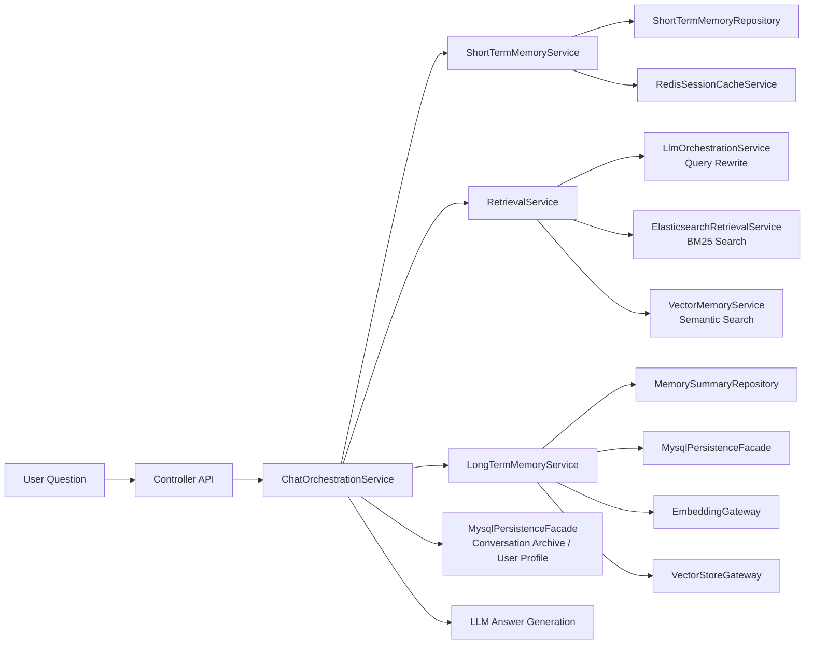

# RAG Pro - 团队智能问答知识库系统

`RAG Pro` 是一个基于 Java 17 与 Spring Boot 3 构建的团队智能问答知识库系统，项目背景来自实验室与同学协作开发时遇到的两个实际问题：

- 团队历史项目和研发文档分散在不同位置，检索效率低。
- 新同学加入后缺少开发背景，培训和重复沟通成本较高。

因此，项目重点围绕三个比较务实、适合本科阶段项目表达的能力展开：

1. **会话短时记忆**：通过滑动窗口、摘要压缩与 Redis 会话缓存维护多轮对话上下文。
2. **会话长时记忆**：通过主动写入、向量化存储与语义相似度召回沉淀长期记忆。
3. **RAG 召回优化**：通过查询重写、语义分块、BM25/向量混合检索提升知识召回准确率。

项目当前重点是把系统思路、模块职责和主要链路表达清楚，整体实现不过度复杂，方便用于课程项目展示、简历描述和面试讲解。

---

## 一、项目简介

该项目面向实验室团队协作与知识沉淀场景，主要可以用于：

- 项目问题问答
- 研发文档问答
- 团队材料管理
- 新同学快速上手与日常培训辅助

当前仓库已经包含：

- Spring Boot 工程结构
- `pom.xml` 中的 Redis / MySQL / LLM 相关依赖
- `application.properties` 中的短时记忆、长时记忆、检索链路配置
- `controller / service / repository / dto / domain / entity / gateway / integration` 分层代码
- 数据库脚本与设计说明文档

说明：当前部分外部系统仍以占位实现为主，重点是先把项目设计思路和工程边界表达清楚，便于后续逐步替换成真实基础设施。

---

## 二、系统架构图




架构职责如下：

- `Controller`：统一承接外部请求入口
- `ChatOrchestrationService`：负责整个问答链路编排
- `ShortTermMemoryService`：负责短期记忆维护与缓存同步
- `LongTermMemoryService`：负责长期记忆写入、向量化与元数据保存
- `RetrievalService`：负责查询重写、混合检索与重排
- `Gateway / Integration`：负责表达外部系统接入边界

---

## 三、核心能力说明

### 1. 会话短时记忆（Short-Term Memory）

目标：保障当前对话轮次中的上下文连续性与时效性。

当前代码中体现为：

- `ShortTermMemoryRepository`：维护会话消息窗口
- `ShortTermMemoryService`：封装滑动窗口读取、窗口同步与短期记忆策略
- `RedisSessionCacheService`：表达 Redis 会话缓存同步能力
- `RedisMemoryGateway` / `RedisSessionMemoryGateway`：表达缓存网关设计

设计思路：

- 将最近 N 轮对话作为滑动窗口缓存
- 当窗口过大时触发摘要压缩
- 摘要与原始消息写入 Redis，实现高性能上下文恢复
- 在问答生成前将短期记忆作为上下文输入给模型

---

### 2. 会话长时记忆（Long-Term Memory）

目标：沉淀用户长期兴趣、偏好、历史问题与高价值对话。

当前代码中体现为：

- `MemorySummary`：长期记忆摘要对象
- `MemorySummaryRepository`：保存摘要结果
- `LongTermMemoryService`：主动写入长期记忆，并联动 embedding / vector / mysql 持久化流程
- `LongMemoryRecordRepository`：表达长期记忆元数据持久化
- `VectorMemoryService` / `VectorStoreGateway`：表达向量化存储与向量召回能力
- `EmbeddingGateway`：表达 embedding 生成能力

设计思路：

- 对有保存价值的问答内容进行摘要抽取
- 将摘要内容向量化并存入向量数据库
- 将摘要元数据保存到 MySQL
- 基于当前问题与历史摘要的语义相似度做召回
- 支撑更稳定的连续问答和简单个性化体验

---

### 3. RAG 召回优化（Retrieval-Augmented Generation）

目标：提升知识召回准确率、可解释性与最终回答质量。

当前代码中体现为：

- `RetrievalService`：统一处理查询重写、混合检索、结果排序
- `ElasticsearchRetrievalService`：表达 BM25 检索服务
- `VectorMemoryService`：表达语义召回服务
- `LlmOrchestrationService`：表达 query rewrite / summary / answer generation
- `LongTermMemoryRepository`：保留 mock 检索结果，便于演示完整召回链路

设计思路：

- **查询重写**：补足用户问题中的业务语义，提升检索表达质量
- **语义分块**：把文档按主题切分，降低长文档噪声
- **混合检索**：结合 BM25 与向量检索，兼顾关键词匹配和语义匹配
- **结果重排**：基于综合得分生成最终上下文

---

## 四、技术选型与配置

### 依赖概览

- `spring-boot-starter-web`：REST API
- `spring-boot-starter-data-redis`：短期记忆 / 会话缓存
- `spring-boot-starter-jdbc` + `mysql-connector-j`：会话归档、长期记忆元数据存储
- `spring-boot-starter-data-elasticsearch`：可选的关键词检索依赖（当前主要用于表达文本检索模块）
- `langchain4j` + `langchain4j-open-ai`：LLM / Embedding 接入抽象

### 配置概览

`application.properties` 已包含以下配置：

- Redis：主机、端口、密码、DB、超时
- MySQL：数据源 URL、用户名、密码、驱动
- 文本检索模块：连接地址、账号、密码
- LLM：供应商、Base URL、API Key、Chat Model
- RAG：chunk size、chunk overlap、query rewrite、rerank、index name
- Long Memory：top-k、similarity threshold、embedding model、vector store

这些配置用于表达系统落地时依赖的基础设施边界，当前更偏向项目演示与方案说明。

---

## 五、项目结构

```text
src/main/java/com/jttpro/ragpro
├── config
│   ├── RagConfig.java
│   └── RagProperties.java
├── controller
│   └── RagDemoController.java
├── domain
│   ├── ChatMessage.java
│   ├── MemoryDocument.java
│   └── MemorySummary.java
├── dto
│   ├── ArchitectureSnapshot.java
│   ├── ChatRequest.java
│   └── ChatResponse.java
├── entity
│   ├── ConversationArchiveEntity.java
│   ├── KnowledgeChunkEntity.java
│   ├── LongMemoryRecordEntity.java
│   └── UserProfileEntity.java
├── gateway
│   ├── EmbeddingGateway.java
│   ├── ElasticsearchGateway.java
│   ├── LlmGateway.java
│   ├── RedisMemoryGateway.java
│   ├── VectorStoreGateway.java
│   └── impl
│       ├── ElasticsearchKnowledgeGateway.java
│       ├── MilvusVectorStoreGateway.java
│       ├── OpenAiEmbeddingGateway.java
│       ├── OpenAiLlmGateway.java
│       └── RedisSessionMemoryGateway.java
├── integration
│   ├── es
│   │   └── ElasticsearchRetrievalService.java
│   ├── llm
│   │   └── LlmOrchestrationService.java
│   ├── mysql
│   │   └── MysqlPersistenceFacade.java
│   ├── redis
│   │   └── RedisSessionCacheService.java
│   └── vector
│       └── VectorMemoryService.java
├── mapper
│   └── LongMemoryRecordMapper.java
├── repository
│   ├── ConversationArchiveRepository.java
│   ├── KnowledgeChunkRepository.java
│   ├── LongMemoryRecordRepository.java
│   ├── LongTermMemoryRepository.java
│   ├── MemorySummaryRepository.java
│   ├── ShortTermMemoryRepository.java
│   └── UserProfileRepository.java
├── service
│   ├── ChatOrchestrationService.java
│   ├── LongTermMemoryService.java
│   ├── RetrievalService.java
│   └── ShortTermMemoryService.java
└── RagproApplication.java
```

---

## 六、数据库设计

仓库中额外包含：

- `docs/schema.sql`
- `docs/database-design.md`

当前设计的核心表包括：

- `user_profile`：用户画像与偏好标签
- `conversation_archive`：完整会话归档
- `long_memory_record`：长期记忆摘要与 embedding 索引映射
- `knowledge_chunk`：知识切块结果

MySQL 主要保存结构化元数据；Redis 承担短期上下文缓存；关键词检索模块负责文本召回；向量库负责 embedding 检索。

---

## 七、核心链路说明

### 一次问答请求的处理流程

调用 `/api/rag/chat` 接口时，系统会模拟以下流程：

1. 用户问题进入短期记忆窗口
2. 当前窗口同步到 Redis 会话缓存
3. 原始 query 经由 LLM 进行重写
4. 并行执行关键词检索与向量检索
5. 对结果进行混合排序
6. 根据需要将有代表性的问答写入长期记忆摘要
7. 摘要写入 MySQL 元数据表，并同步到向量库
8. 结合短期上下文和召回结果生成最终回答
9. 把回答再次写回短期记忆与会话归档，形成闭环

---

## 八、接口示例

### 1. 查看系统架构摘要

`GET /api/rag/architecture`

返回项目定位、短期记忆设计、长期记忆设计、RAG 召回设计和项目亮点。

### 2. 发起一次问答

`POST /api/rag/chat`

示例请求：

```json
{
  "sessionId": "session-001",
  "userId": "user-001",
  "question": "团队文档比较分散时，怎么设计一个带短时记忆和长时记忆的问答知识库系统？",
  "persistToLongMemory": true
}
```

示例返回：

```json
{
  "sessionId": "session-001",
  "rewrittenQuery": "[llm-rewrite] 围绕团队知识库、会话记忆和混合检索优化的问题：团队文档比较分散时，怎么设计一个带短时记忆和长时记忆的问答知识库系统？",
  "answer": "LLM 生成回答占位：针对问题【团队文档比较分散时，怎么设计一个带短时记忆和长时记忆的问答知识库系统？】结合上下文【会话上下文：... | 召回结果：... | 用户偏好：... | 会话摘要占位：...】输出最终答案。",
  "shortMemoryStrategy": "滑动窗口 + 摘要压缩 + Redis 存储，保障多轮对话上下文完整与即时连贯。",
  "longMemoryStrategy": "主动写入 + 向量化存储 + MySQL 元数据保存 + 语义相似度召回，构建精准可控的长期记忆机制。",
  "retrievalSteps": [
    "查询重写：通过 LLM 补全业务语义，提升召回意图清晰度",
    "语义分块：按主题对知识片段切分，降低噪声干扰",
    "混合检索：并行执行 BM25 与向量检索",
    "结果重排：根据向量分与关键词分生成最终上下文"
  ],
  "references": [
    "团队开发规范总结(vector-store)",
    "实验室新人培训手册(vector-store)",
    "项目文档文本召回(keyword-search)"
  ]
}
```

### 3. 查看已写入的长期记忆摘要

`GET /api/rag/long-memory`

用于查看长期记忆主动写入结果。

---

## 九、后续可扩展方向

- 接入真实 Redis、MySQL、文本检索引擎、Milvus / pgvector 等基础设施
- 将占位式 LLM 网关替换为真实模型调用
- 增加知识文档导入、分块、索引构建链路
- 增加简单的后台管理页面，方便上传和维护团队资料
- 增加日志记录与基础监控，便于排查问答链路问题

---

## 十、技术栈

- Java 17
- Spring Boot 3
- Maven
- Redis
- MySQL
- 关键词检索 / 文本检索模块
- LangChain4j
- RESTful API
- Mock / Placeholder 向量检索、文本检索、长期记忆写入、LLM 调用

---

## 十一、适合简历的项目描述

你可以把这个项目概括为：

- 在实验室与同学协作开发过程中，针对团队历史项目和文档分散、新人培训成本较高的问题，设计并实现团队智能问答知识库系统。
- 设计会话短时记忆机制，采用滑动窗口 + 摘要压缩 + Redis 存储，保证多轮对话上下文完整和即时连贯。
- 设计会话长时记忆机制，采用主动录入 + 向量化存储 + 语义相似度召回，支持历史经验沉淀和个性化问答。
- 通过查询重写、语义分块、关键词检索与向量检索混合召回，提升研发文档问答和项目问题检索的准确性。
- 系统可用于团队项目问答、研发资料管理和新人培训辅助，减少重复提问，降低沟通成本。

